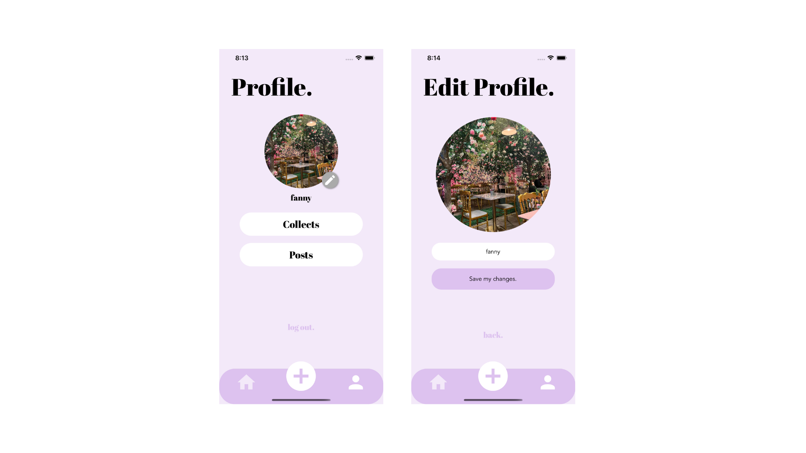
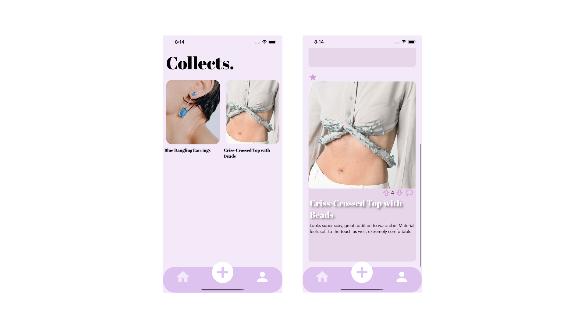

# Fanta Beauty - Milestone 3

## Team Name

Fanta Beauty

## Level of Achievement

Apollo 11

## Motivation

Have you ever peeked into your shopping cart and thought: “Will this look nice on me!”? Spent a few hours on websites scrolling through pages of listings but failed to find real reviews by real people? Are you constantly doubting your fashion decisions, wondering if it’s fit for your body type?

It is not rare for online shoppers to regret their fashion purchases due to inaccurate description and limited reviews, wasting their money on returning unfit clothing. Some may also buy from online fashion platforms that are based overseas and hence cannot afford wasting time on making an exchange. Unlike in physical stores where shoppers can easily try on clothes, online shoppers would have to take their own measurements, which is more inconvenient and difficult to visualize. Living in a fast-paced society, people are bombarded by their hectic schedules, so they have no time to research fashion trends and build better outfits.

## Aim

We aim to let users share their reviews and help them purchase fitting and ideal fashion apparel online in a quick and fuss-free way.

## About Fanta Beauty

Fanta Beauty is a fashion platform that allows users to share their first-hand reviews and helps users purchase fitting and ideal fashion apparel online in a quick and fuss-free way. It provides young females who are regular online shoppers a platform to share their purchases with the implementation of a review uploader, for our target audience to visualize the clothing on a real person, such that they can make wise purchases. You can easily add clothes in the wishlist and get fashion tips as well as information on the latest trends.

## User Stories

1. As a frugal youth who is unsure about how the clothes would look in real life, I want to get first-hand reviews to make sure the clothes fit to avoid wasting time and money on exchanges and returns.
2. As a busy user who wants to save time and effort on toggling between different shopping sites, I want to have my wishlist conveniently organized in one place.
3. As an older generation who is new to online shopping, I want to see pictures of the clothes taken in real life and visualize how the clothes would look on me.
4. As a fashion enthusiast who loves to discuss and share about trends, I want a platform where I can share and discuss tips and reviews with like-minded individuals.

## Features

### Authentication pages

1. Welcome Screen

   When logged out, users will be first directed to the Welcome Screen, where they can choose to navigate to the Register Screen for first-time users, or to the Login Screen if they already have an account.

2. Register Screen

   New users can create a new account using a valid email address and set a username and password. This feature is backed with Firebase authentication.

3. Login Screen

   Users can log in to the app using their email address and password.

4. Forgot Password Screen

   Users who wish to forget their password will receive an OTP sent to their email address, provided an account exists under that address.

   

---

### Bottom Tab Navigator

The Bottom Tab Navigator provides quick access to the basic pages: Home Screen, Upload Screen and Profile Screen.

---

### Home Screen

The Home page will be the default page that logged in users will first see. Similar to a Feed page on our social media apps, it displays a scrollable section of reviews with title which directs users to the corresponding review upon clicking, where users can get the details of the post and perform various actions.

1. Search

   Upon clicking on the magnify icon, users will be able to enter keywords to search for specific items, or explore a particular category to find out about more clothing items available.

2. Save

   If a user finds a particular post useful/interesting, they may star it to save to their Collects page for easy reference in the future.

3. Upvote/Downvote

   This voting system aims to encourage creators to submit useful and accurate reviews, and for viewers to know the reliability of the post to help with decision making.

4. Comments

   Users may add on their own review if they deem it useful to the specific item/comment on the review itself for further discussion.

---

### Upload Screen

Users may upload their own post here. They are required to upload:

1. An image of the item
2. A relevant category - aids with the searching of items by other users
3. Title (name of the item)
4. Their review.

The post will be uploaded to our database, Firestore.

---

### Profile Pages

1. Profile Screen

   A customizable page that displays the users’ profile picture and username, and provides users with quick access to our key features, such as saved posts, my posts, as well as the option to log out of their account.

2. Edit Profile Screen

   Allows users to change their profile picture and username to make the account more customized to each user.

---

### My Post Screen

Stores all the reviews uploaded by the users. Here, the users will be able to delete their posts or make edits to their reviews.

---

### Saved Post Screen

Stores all the reviews saved by the users for easy reference in the future, which are clickables directed to the review page. Users may choose to unsave the posts by clicking on the starred icon too.

---

## Technical Proof of Concept

### Executing the program

1. Install npm/yarn on https://nodejs.org/en/ or https://classic.yarnpkg.com/lang/en/docs/install/#mac-stable

2. Download zip from this github repository https://github.com/fannyjian/fanta-beauty.

3. On your terminal, change to the directory fanta-beauty-main and run:

   1. `npm install` or `yarn install`
   2. `npm start` or `yarn start`

4. Download the Expo app on your iPhone.

5. Scan the QR code with an iPhone camera and you will be redirected to the Expo app. Please ensure that your phone is connected to the same network as your PC.

6. Open it in the Expo app on your iPhone to view it.
